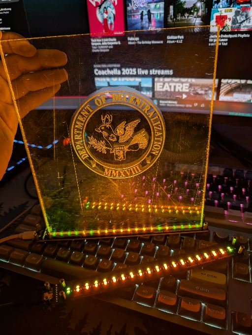

# DOD Stammtischschild

Fabrication files for the DOD Stammtisch sign.

Inspired by the [c-base/stammtischschild](https://github.com/c-base/stammtischschild).
Main differences:
- use visicut over fengrave
- no battery, just USB-C
- no ESP, just colored LEDs
- KISS

Contents:
- [visicut/](./visicut): laser engraving of the DOD wolpy
- [kicad/](./kicad): schematics, footprints, and pcb design

The afk-screenshot above shows an early production prototype (with USB-C breakout).
