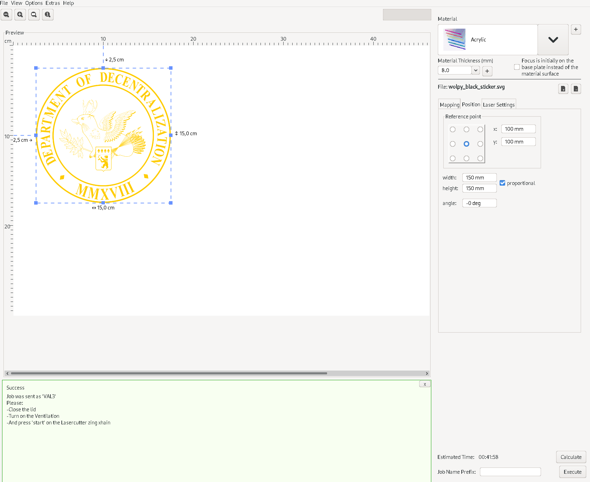

# Laser Engraving

VisiCut profile, configuration, and machine code.

Uses the profile of the xHain lasercutter used to engrave the DoD sign.

https://wiki.x-hain.de/en/Branches/Maschinenraum/Lasercutter
